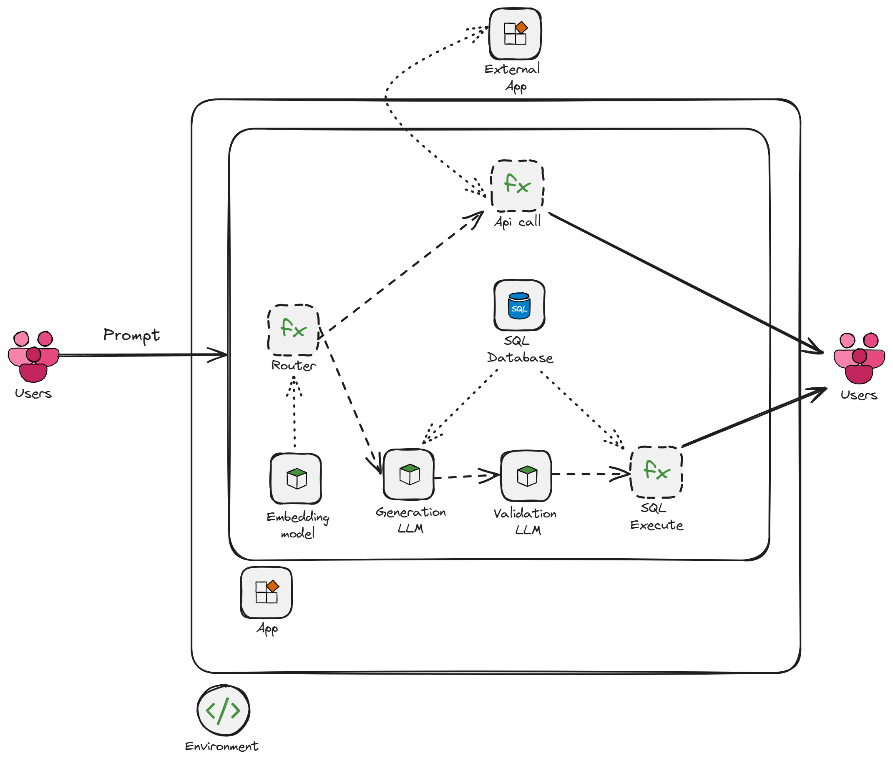

# sql-chatbot

## Description

`sql-chatbot` is a Proof of Concept (POC) for a SQL Chatbot that can process natural language questions and convert them into SQL queries. It also includes a router to handle API requests and SQL queries.

## Features

- Route questions to either a SQL chatbot or a external API
- Convert natural language questions into SQL queries.
- Validate and correct SQL queries.
- Execute SQL queries on a SQLite database.
- Handle API requests.

## Design squema



## Installation

1. Clone the repository:
    ```sh
    git clone https://github.com/yourusername/sql-chatbot.git
    cd sql-chatbot
    ```

2. Install dependencies using Poetry:
    ```sh
    make install
    ```

3. Set up the environment variables:
    ```sh
    echo "API_KEY_NASA=..." >> .env
    ```
    You can generate one api key in https://api.nasa.gov/

## Usage

1. Start the FastAPI server:
    ```sh
    make run
    ```

2. Access the API documentation at `http://127.0.0.1:8000/docs`.

3. Example of a POST request to the `/ask` endpoint:
    ```sh
    curl -X POST "http://127.0.0.1:8000/ask" -H "Content-Type: application/json" -d '{"question": "Cuantos clientes hay?"}'
    ```

## Testing

Run the tests using `pytest`:
```sh
make test
```